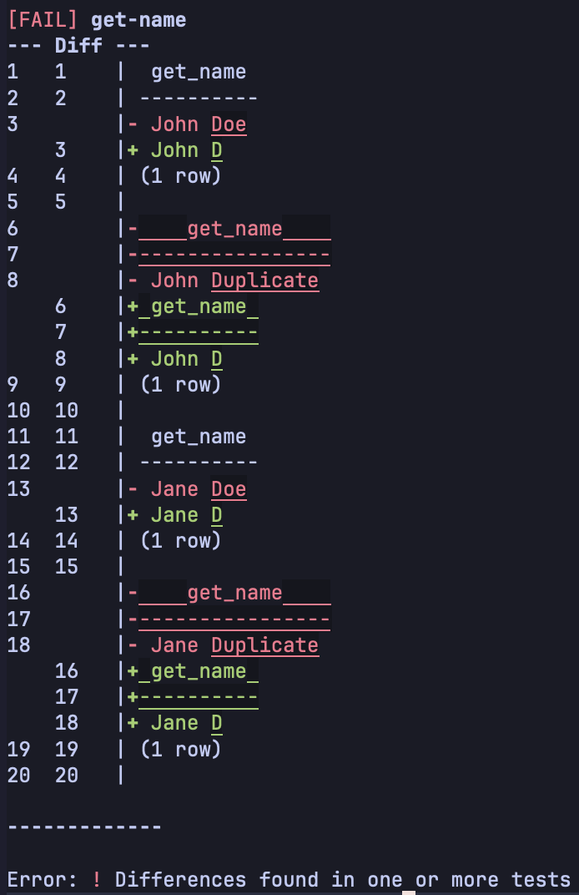

# Spawn

## Database Build System.

[](LICENSE)
[](https://docs.spawn.dev)

I like to lean heavily on the database. I don't like tools that abstract away the raw power of databases like PostgreSQL. Spawn is designed for developers who want to use the full breadth of modern database features – Functions, Views, Triggers, RLS – in a way that's easy to manage.

Spawn introduces **Components**, **Compilation**, **Reproducibility**, and **Testing** to SQL migrations.

## Installing

[](https://docs.spawn.dev/getting-started/install/)

Or simply:

```bash
# Install (macOS/Linux)
curl --proto '=https' --tlsv1.2 -LsSf https://github.com/saward/spawn/releases/latest/download/spawn-db-installer.sh | sh
```

## Quick Start

Initialize a new project, with an example `docker compose` setup ready to work out of the box via `spawn init --docker` (or just use `spawn init` for an existing project):

```bash
% spawn init --docker
Created docker-compose.yaml for database 'postgres'
Start the database with: docker compose up -d

▶ Spawn collects anonymous usage data.
  This helps us improve Spawn.
  Set "telemetry = false" in spawn.toml or use DO_NOT_TRACK=1 to opt-out.

Initialized spawn project with project_id: 5bb5a4eb-3677-4dc1-84d6-52b768180171
Created directories:
  spawn/migrations/
  spawn/components/
  spawn/tests/
  spawn/pinned/

Edit spawn.toml to configure your database connection.
```

This creates a `docker-compose.yaml`, a `spawn.toml`, and the `spawn/` project structure:

```bash
% tree
.
├── docker-compose.yaml
├── spawn
│   ├── components
│   ├── migrations
│   ├── pinned
│   └── tests
└── spawn.toml

6 directories, 2 files
```

Start the database, and you're ready to create your first migration:

```bash
% docker compose up -d
```

Related docs:

- [spawn init](https://docs.spawn.dev/cli/init/)
- [Welcome to Spawn](https://docs.spawn.dev/getting-started/magic/)

## Documentation

Full documentation, recipes, and configuration guides are available at:

### [👉 docs.spawn.dev](https://docs.spawn.dev)

## Features

### Familiar migrations

Migrations are just timestamped folders with an `up.sql` script:

```bash
.
├── docker-compose.yaml
├── spawn
│   ├── components
│   │   └── users
│   │       └── name.sql
│   ├── migrations
│   │   ├── 20260829121054-name-example
│   │   │   ├── lock.toml
│   │   │   └── up.sql
│   │   └── 20260829123838-update-name
│   │       └── up.sql
```

Apply a migration with `spawn migration apply <migration>`, or see status with `spawn migration status`:

```bash
% spawn migration apply 20260829121054-name-example
Migration '20260829121054-name-example' applied successfully
All migrations applied successfully.
mark@Marks-MacBook-Air-M2 spawntest % spawn migration status

┌─────────────────────────────┬────────────┬────────┬──────────┬───────────┐
│ Migration                   │ Filesystem │ Pinned │ Database │ Status    │
├─────────────────────────────┼────────────┼────────┼──────────┼───────────┤
│ 20260829121054-name-example │ ✓          │ ✓      │ ✓        │ ✓ Applied │
│ 20260829123838-update-name  │ ✓          │ ✓      │ ✗        │ ○ Pending │
└─────────────────────────────┴────────────┴────────┴──────────┴───────────┘
```

Related docs:

- [spawn migration apply](https://docs.spawn.dev/cli/migration-apply/)
- [spawn migration status](https://docs.spawn.dev/cli/migration-status/)

### Reusable components

Spawn uses [Minijinja](https://github.com/mitsuhiko/minijinja) under the hood to provide powerful templating abilities to your migrations.

Create reusable components and include them in a migration:

_`spawn/components/users/name.sql`_:

```sql
CREATE OR REPLACE FUNCTION get_name(first text, last text) RETURNS text AS $$
BEGIN
    RETURN first || ' ' || last; -- V1 Logic
END;
$$ LANGUAGE plpgsql;
```

```
% spawn migration new name-example

creating migration with name 20260829121054-name-example
creating migration at spawn/migrations/20260829121054-name-example/up.sql
New migration created: 20260829121054-name-example
```

_`spawn/migrations/20260829121054-name-example/up.sql`_:

```sql
BEGIN;
CREATE TABLE users (id serial, first text, last text);
 -- Include the component
COMMIT;
```

Building the migration with `spawn migration build 20260829121054-name-example` produces:

```sql
BEGIN;
CREATE TABLE users (id serial, first text, last text);
CREATE OR REPLACE FUNCTION get_name(first text, last text) RETURNS text AS $$
BEGIN
    RETURN first || ' ' || last; -- V1 Logic
END;
$$ LANGUAGE plpgsql;
 -- Include the component
COMMIT;
```

Related docs:

- [Welcome to Spawn](https://docs.spawn.dev/getting-started/magic/)
- [Templating](https://docs.spawn.dev/reference/templating/)
- [spawn migration new](https://docs.spawn.dev/cli/migration-new/)
- [spawn migration build](https://docs.spawn.dev/cli/migration-build/)

### Reproducible builds

Pin a migration (similar to `git commit`) via `spawn migration pin <migration>`, so that future changes to a component don't change the output of an old migration.

This allows you to edit a component _in place_, so that when you submit a PR, you can see exactly what's changed. Other tools often require you to duplicate some snippet, and then edit the copy, resulting in a big wall of green. Repeatable migrations help mitigate this, but have other limitations (e.g., running through migrations from start to finish).

Pin a migration:

```bash
% spawn migration pin 20260829121054-name-example
Migration pinned: 4219bf4255dee5b32b1154d68fa4fab2
```

Now if you edit `spawn/components/users/name.sql` and include it in a new migration, the old migration uses the old version of `spawn/components/users/name.sql`, ensuring that old migrations run as they once did.

This allows you to edit components in place, keeping the full git history of changes to them. No need to copy and then edit when making changes.

We can update our `get_name` function, changing the logic (_`spawn/components/users/name.sql`_):

```sql
...
    RETURN first || ' ' || substring(last, 1, 1); -- V2 Logic
...
```

Then create a new migration to apply the updated function to our database:

```bash
% spawn migration new update-name

creating migration with name 20260829123838-update-name
creating migration at spawn/migrations/20260829123838-update-name/up.sql
New migration created: 20260829123838-update-name
```

In that migration, import the component/function as we did in the first migration:

```sql
BEGIN;
-- Re-import the SAME component file, which now contains V2 logic

COMMIT;
```

Now if we build the old migration, we see the old version of the name function still:

```bash
% spawn migration build 20260829121054-name-example --pinned
BEGIN;
CREATE TABLE users (id serial, first text, last text);
CREATE OR REPLACE FUNCTION get_name(first text, last text) RETURNS text AS $$
BEGIN
    RETURN first || ' ' || last; -- V1 Logic
END;
$$ LANGUAGE plpgsql;
 -- Include the component
COMMIT;
```

But the new migration shows the new logic:

```bash
% spawn migration pin 20260829123838-update-name
Migration pinned: 9a3a3d70587fca77197ade26877d589b
% spawn migration build 20260829123838-update-name --pinned
BEGIN;
-- Re-import the SAME component file, which now contains V2 logic
CREATE OR REPLACE FUNCTION get_name(first text, last text) RETURNS text AS $$
BEGIN
    RETURN first || ' ' || substring(last, 1, 1); -- V2 Logic
END;
$$ LANGUAGE plpgsql;

COMMIT;
```

The component changed, but the old migration still shows the same old logic while the new migration includes the new logic. This gives repeatable builds where you can rerun your migrations from start to finish, all while keeping a nice reviewable git history.

Related docs:

- [spawn migration new](https://docs.spawn.dev/cli/migration-new/)
- [spawn migration build](https://docs.spawn.dev/cli/migration-build/)
- [spawn migration pin](https://docs.spawn.dev/cli/migration-pin/)

### Golden file tests

Write tests to validate the behaviour of your functions, triggers, views, etc. Writing a test involves:

1. Create the test, a single plain SQL file.
2. Establish the expected output via an `expect` file (via `spawn test expect <name>`).
3. Run test, which compares `expect`ed output to actual output.

Create a test, and apply the first migration from before:

```bash
% spawn test new get-name
creating test with name get-name
creating test at spawn/tests/get-name/test.sql
New test created: get-name
% spawn migration apply 20260829121054-name-example
Migration '20260829121054-name-example' applied successfully
All migrations applied successfully.
% spawn migration status

┌─────────────────────────────┬────────────┬────────┬──────────┬───────────┐
│ Migration                   │ Filesystem │ Pinned │ Database │ Status    │
├─────────────────────────────┼────────────┼────────┼──────────┼───────────┤
│ 20260829121054-name-example │ ✓          │ ✓      │ ✓        │ ✓ Applied │
│ 20260829123838-update-name  │ ✓          │ ✓      │ ✗        │ ○ Pending │
└─────────────────────────────┴────────────┴────────┴──────────┴───────────┘
```

Edit `test.sql` to call the function a few times:

```sql
SELECT get_name('John', 'Doe');
SELECT get_name('John', 'Duplicate');
SELECT get_name('Jane', 'Doe');
SELECT get_name('Jane', 'Duplicate');
```

We can see what the test will produce:

```bash
% spawn test run get-name
 get_name
----------
 John Doe
(1 row)

    get_name
----------------
 John Duplicate
(1 row)

 get_name
----------
 Jane Doe
(1 row)

    get_name
----------------
 Jane Duplicate
(1 row)
```

That looks right, so let's set this output as our expectation, and run to confirm it passes:

```bash
# This creates an expect file:
% spawn test expect get-name
% head -n 4 spawn/tests/get-name/expected
 get_name
----------
 John Doe
(1 row)
# This runs the actual test, comparing actual output to expected:
% spawn test compare get-name
[PASS] get-name
```

Now let's apply our next migration which changes how `get_name` works, and run the test again:

```bash
% spawn migration apply 20260829123838-update-name
Migration '20260829123838-update-name' applied successfully
All migrations applied successfully.
% spawn test compare get-name
```



As expected, the test now fails because our `get_name` logic has changed. Here we see a colourful diff, highlighting the fact that our change in how `get_name` works has broken our test.

Related docs:

- [spawn test new](https://docs.spawn.dev/cli/test-new/)
- [spawn test run](https://docs.spawn.dev/cli/test-run/)
- [spawn test expect](https://docs.spawn.dev/cli/test-expect/)
- [spawn test compare](https://docs.spawn.dev/cli/test-compare/)
- [Test Macros](https://docs.spawn.dev/recipes/test-macros/)
- [Non-determinism in Tests](https://docs.spawn.dev/recipes/non-determinism-tests/)
- [Powerful regression tests for your PostgreSQL project](https://docs.spawn.dev/blog/regression-tests/)

### Reusable test functions

Spawn SQL tests are templates that can make use of the same powerful [Minijinja](https://github.com/mitsuhiko/minijinja) templating features, along with some helper functions.

#### Reusable components

Components allow you to do powerful things. For example, perhaps you want to make it easy to create a particular record for tests. Let's say we have a database structure like so:

```sql
CREATE TABLE customer (
    customer_id BIGSERIAL PRIMARY KEY,
    name TEXT NOT NULL
);

CREATE TABLE address (
    address_id BIGSERIAL PRIMARY KEY,
    address_line TEXT NOT NULL
);

CREATE TABLE customer_address (
    customer_id BIGINT NOT NULL REFERENCES customer(customer_id),
    address_id BIGINT NOT NULL REFERENCES address(address_id),

    PRIMARY KEY (customer_id, address_id)
);
```

It's tedious to write the SQL to create test customers, so let's make a macro in `spawn/components/tests/helpers/create_customer.sql`:

```sql


insert into customer (
    customer_id,
    name
) values (
    {{ customer_id }},
    {{ name }}
)
returning customer_id as created_customer_id
\gset

insert into address (
    address_id,
    address_line
) values (
    {{ address_id }},
    {{ address_line }}
)
returning address_id as created_address_id
\gset

insert into customer_address (
    customer_id,
    address_id
) values (
    :created_customer_id,
    :created_address_id
);


```

This uses some `psql` features, allowing us to optionally provide address and customer id.

Then we can call it in a test (`spawn/tests/create-customer/test.sql`):

```sql


{{ create_customer() }}
{{ create_customer(address_id=4, name="Bob Jane") }}

SELECT * FROM customer;
SELECT * FROM address;
SELECT * FROM customer_address;
```

This makes it really simple to create test data for tests, overriding details when required. The SQL it produces is the same as the below, massively reducing repetition and making tests easier to read:

```sql
insert into customer (
    customer_id,
    name
) values (
    DEFAULT,
    'Test Customer'
)
returning customer_id as created_customer_id
\gset

insert into address (
    address_id,
    address_line
) values (
    DEFAULT,
    '1 Test Street'
)
returning address_id as created_address_id
\gset

insert into customer_address (
    customer_id,
    address_id
) values (
    :created_customer_id,
    :created_address_id
);


insert into customer (
    customer_id,
    name
) values (
    DEFAULT,
    'Bob Jane'
)
returning customer_id as created_customer_id
\gset

insert into address (
    address_id,
    address_line
) values (
    4,
    '1 Test Street'
)
returning address_id as created_address_id
\gset

insert into customer_address (
    customer_id,
    address_id
) values (
    :created_customer_id,
    :created_address_id
);

SELECT * FROM customer;
SELECT * FROM address;
SELECT * FROM customer_address;
```

When we run it, we see:

```bash
% spawn test run create-customer
 customer_id |     name
-------------+---------------
           1 | Test Customer
           2 | Bob Jane
(2 rows)

 address_id | address_line
------------+---------------
          1 | 1 Test Street
          4 | 1 Test Street
(2 rows)

 customer_id | address_id
-------------+------------
           1 |          1
           2 |          4
(2 rows)
```

Related docs:

- [spawn test run](https://docs.spawn.dev/cli/test-run/)
- [Test Macros](https://docs.spawn.dev/recipes/test-macros/)
- [Non-determinism in Tests](https://docs.spawn.dev/recipes/non-determinism-tests/)

### Helper functions and utilities

Spawn provides a handful of helper functions and utilities that can be used in both migrations and tests.

Create a v4 uuid (most of the time you'd likely use the built in database uuid generation function):

```sql
INSERT INTO users (id, name) VALUES ({{ gen_uuid_v4() }}, {{ user_name }});
```

Include bytes from a file, which can be useful for testing:

```sql
INSERT INTO images (data) VALUES (decode({{ "images/logo.png"|read_file|base64_encode }}, 'base64'));
```

Run code only when applying to a dev database target:

```sql

-- Insert test data only in dev
INSERT INTO users (email) VALUES ('test@example.com');

```

Use data passed in via `--variables` (e.g., `variables.json`):

```json
{
  "table_name": "users",
  "admin_email": "admin@example.com"
}
```

And then reference it within your migration or test:

```sql
CREATE TABLE {{ variables.table_name | escape_identifier }} (
  id SERIAL PRIMARY KEY,
  email TEXT NOT NULL
);

INSERT INTO {{ variables.table_name | escape_identifier }} (email)
VALUES ({{ variables.admin_email }});
```

Related docs:

- [Templating](https://docs.spawn.dev/reference/templating/)

### Secure by default

Spawn helps to protect your SQL from malicious input by making the secure option the default one. Spawn auto-escapes every `{{}}` value as a SQL literal by default. E.g., consider the following insert:

```sql
INSERT INTO users (name, age) VALUES ({{ user_name }}, {{ user_age }});
```

If `user_name` is `O'Reilly` and `user_age` is `42`, that produces:

```sql
INSERT INTO users (name, age) VALUES ('O''Reilly', 42);
```

And a malicious value is escaped automatically:

```sql
-- user_name = "'; DROP TABLE users; --"
INSERT INTO users (name) VALUES ('''; DROP TABLE users; --');
```

Sometimes, you need to use a value as an identifier (such as a table name) rather than a value. In those situations, you can use the `escape_identifer` filter:

```sql
SELECT * FROM my_schema.{{ table_name | escape_identifier }} my_table;
```

Or if you know the value is safe and you want to use it as it is, unmodified and unescaped, you can do so with the `safe` filter:

```sql

SELECT * FROM users WHERE {{ conditions | safe }};
```

Related docs:

- [Templating](https://docs.spawn.dev/reference/templating/)

### Data from JSON

In the preceding section, we saw a way to pass in variables as a command line parameter. But sometimes you may want to make use of data from a fixture that you can use in tests automatically.

Let's say we want to create a handful of customers, using the macro from the [Reusable components](#reusable-components-1) section above, but making use of data in a file in our `components` folder. _`spawn/components/tests/helpers/customers.json`_:

```json
[
  {
    "name": "Alice Brown",
    "address": "1 King Street"
  },
  {
    "name": "Ben Carter",
    "address": "22 High Street"
  },
  {
    "name": "Chloe O'Davis",
    "address": "7 Station Road"
  },
  {
    "name": "Daniel Evans",
    "address": "14 Market Lane"
  },
  {
    "name": "Emma Foster",
    "address": "3 Victoria Avenue"
  }
]
```

We might want to loop over this to create a handful of test cases. To do that, in our test (this works for migration scripts too), you can import this JSON and loop over it, using our macro to create test clients:

```sql


-- Use 'WITH TEMPLATE' so you can run the test repeatedly with a fresh
-- copy each time:
DROP DATABASE IF EXISTS create_customer_test;
CREATE DATABASE create_customer_test WITH TEMPLATE postgres;
\c create_customer_test



  {{ create_customer(name=customer.name, address_line=customer.address) }}


SELECT * FROM customer;
SELECT * FROM address;
SELECT * FROM customer_address;

\c postgres
DROP DATABASE IF EXISTS create_customer_test;
```

And then if we run it, we see the test created all our customers from the JSON fixture:

```
% spawn test run create-customer
 customer_id |     name
-------------+---------------
           3 | Alice Brown
           4 | Ben Carter
           5 | Chloe O'Davis
           6 | Daniel Evans
           7 | Emma Foster
(5 rows)

 address_id |   address_line
------------+-------------------
          2 | 1 King Street
          3 | 22 High Street
          4 | 7 Station Road
          5 | 14 Market Lane
          6 | 3 Victoria Avenue
(5 rows)

 customer_id | address_id
-------------+------------
           3 |          2
           4 |          3
           5 |          4
           6 |          5
           7 |          6
(5 rows)
```

Related docs:

- [Templating](https://docs.spawn.dev/reference/templating/)
- [spawn test build](https://docs.spawn.dev/cli/test-build/)
- [spawn test run](https://docs.spawn.dev/cli/test-run/)
- [Test Macros](https://docs.spawn.dev/recipes/test-macros/)
- [Non-determinism in Tests](https://docs.spawn.dev/recipes/non-determinism-tests/)
- [Powerful regression tests for your PostgreSQL project](https://docs.spawn.dev/blog/regression-tests/)

### GitHub action

Spawn has a GitHub action you can include to run your tests and check for any unpinned migrations (it's usually best to pin a migration once you're finished with it):

```yaml
- name: Install Spawn
  uses: saward/spawn-action@v1

- name: Run check
  run: |
    spawn check

- name: Run tests
  run: |
    spawn test compare test-1
    spawn test compare test-2
```

Related docs:

- [CI/CD](https://docs.spawn.dev/reference/ci-cd/)
- [spawn check](https://docs.spawn.dev/cli/check/)
- [spawn pin cleanup](https://docs.spawn.dev/cli/pin-cleanup/)

### Multiple database targets

You can specify multiple database targets in your `spawn.toml` config file. For example, you can set up a postgres-psql target:

```toml
# spawn.toml
[targets.local]
engine = "postgres-psql"
spawn_database = "postgres"
spawn_schema = "_spawn"
environment = "dev"

[targets.local.command]
kind = "direct"
direct = ["docker", "exec", "-i", "postgres-db", "psql", "-U", "postgres", "postgres"]
```

And then execute commands against a specific target. E.g.:

```bash
% spawn migration status --target local

┌─────────────────────────────┬────────────┬────────┬──────────┬───────────┐
│ Migration                   │ Filesystem │ Pinned │ Database │ Status    │
├─────────────────────────────┼────────────┼────────┼──────────┼───────────┤
│ 20260829121054-name-example │ ✓          │ ✓      │ ✓        │ ✓ Applied │
│ 20260829123838-update-name  │ ✓          │ ✓      │ ✓        │ ✓ Applied │
└─────────────────────────────┴────────────┴────────┴──────────┴───────────┘
```

Connecting to production databases can be configured to use all your standard commands. You just need to provide it with a valid psql pipe.
Spawn supports **Provider Commands**. Configure it to use `gcloud`, `aws`, or `az` CLIs to resolve the connection or SSH tunnel automatically.

```toml
# spawn.toml
[targets.prod]
...

[targets.prod.command]
kind = "provider"
provider = ["gcloud", "compute", "ssh", "--dry-run", ...]
append = ["psql", ...]
...
```

Related docs:

- [Database Connections](https://docs.spawn.dev/guides/manage-databases/)
- [Configuration File (spawn.toml)](https://docs.spawn.dev/reference/config/)

## Comparison

| Feature              | **Spawn**                                                                            | **Sqitch**                                                                               | **Flyway**                                                                    | **dbmate**                                                     |
| :------------------- | :----------------------------------------------------------------------------------- | :--------------------------------------------------------------------------------------- | :---------------------------------------------------------------------------- | :------------------------------------------------------------- |
| **Core Philosophy**  | **Compiled.** Database logic is a codebase. Migrations are build artifacts.          | **DAG.** A dependency graph of changes. No linear version numbers.                       | **Linear.** Run scripts V1 → V2. "Repeatable" scripts run at the end.         | **Simple.** Just run these SQL files in order.                 |
| **Views/Functions**  | **Pinned Components.** Edit in place. Snapshots locked per-migration (CAS).          | **Versioned Copies.** The rework command creates a new physical file for old migrations. | **Repeatable.** Re-runs `R__` scripts every migration. Doesn't track history. | **Manual.** Copy-paste old logic into new migrations manually. |
| **Templating**       | **Native (Minijinja).** Macros, loops, and variables inside SQL.                     | **None.** Raw SQL only.                                                                  | **Basic.** `${placeholder}` substitution only.                                | **None.** Raw SQL only.                                        |
| **Testing**          | **Built-in.** `spawn test` with ephemeral DBs & diff assertions.                     | **Verify Scripts.** Boolean (Pass/Fail) scripts run after deploy.                        | **None.** Relies on external CI tools.                                        | **None.**                                                      |
| **Dependencies**     | **Single Binary** (Rust) + `psql` CLI.                                               | **Perl.**                                                                                | **JRE / Binary.**                                                             | **Single Binary** (Go). Very easy install.                     |
| **Rollbacks**        | 🚧 _Planned._ Currently manual, but not needed as much with pinning.                 | **First Class.** Every change _must_ have a revert script.                               | **Paid.** `Undo` functionality often gated behind Pro/Enterprise.             | **Supported.** `down.sql` files are standard.                  |
| **DB Support**       | **PostgreSQL** (Focus on depth).                                                     | **Massive.** Postgres, MySQL, Oracle, SQLite, Vertica, etc.                              | **Massive.** Every DB known to man.                                           | **Broad.** Postgres, MySQL, SQLite, ClickHouse.                |
| **Execution Engine** | **Native CLI Wrapper.** Full parity with `psql` (supports `\copy`, `\gset`, `\set`). | **Native Drivers.**                                                                      | **JDBC.** (Java Database Connectivity).                                       | **Native Drivers.** (Go drivers).                              |
| **License**          | **AGPL-3.0**                                                                         | **MIT**                                                                                  | **Apache 2.0** (Community) / Proprietary (Teams).                             | **MIT**                                                        |

## Roadmap

Spawn is currently in **Public Beta**. It is fully functional and has test suites to help prevent regressions, but should be considered experimental software. We recommend testing thoroughly before adopting it for critical production workloads.

**Currently Supported:**

- ✅ PostgreSQL via psql support
- ✅ Core Migration Management (Init, New, Apply)
- ✅ Component Pinning & CAS
- ✅ Minijinja Templating
- ✅ Testing Framework (Run, Expect, Compare)
- ✅ Database Tracking & Advisory Locks
- ✅ [CI/CD Integration](https://docs.spawn.dev/reference/ci-cd/)

**What's Next:**

- 🔄 **Rollback Support:** Optional down scripts for reversible migrations.
- 🔄 **Additional Engines:** Native PostgreSQL driver, MySQL, and more.
- 🔄 **Multi-Tenancy:** First-class support for schema-per-tenant migrations.
- 🔄 **External Data Sources:** Better support for data from files, URLs, and scripts in templates.
- 🔄 **Plugin System:** Custom extensions for engines, data sources, and workflows.

_(See [Roadmap](https://docs.spawn.dev/reference/roadmap) for detailed tracking)_

---

## Telemetry

Spawn collects anonymous usage data, to help us improve Spawn. Set `"telemetry = false"` in `spawn.toml` or use `DO_NOT_TRACK=1` to opt-out.

## Contributing

Please read [CONTRIBUTING.md](CONTRIBUTING.md) before opening a PR. Note that this project requires signing a CLA.

## LLM Disclaimer

I (Mark) estimate that 90% of the code/design/architecture has been done by myself (2026-02-12), but I do use LLM's for filling in tedious gaps. All LLM changes are reviewed to ensure they fit with the current design and future vision.
