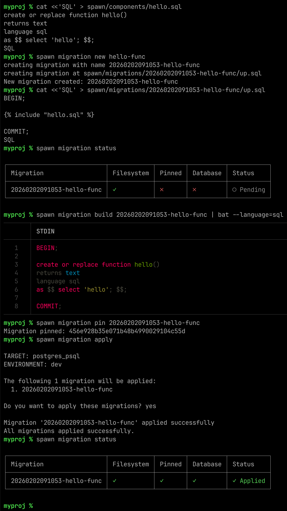

# Spawn

## Database Build System.

[](LICENSE)
[](https://docs.spawn.dev)

I like to lean heavily on the database. I don't like tools that abstract away the raw power of databases like PostgreSQL. Spawn is designed for developers who want to use the full breadth of modern database features – Functions, Views, Triggers, RLS – in a way that's easy to manage.

Spawn introduces **Components**, **Compilation**, **Reproducibility**, and **Testing** to SQL migrations.

## Installing

[](https://docs.spawn.dev/getting-started/install/)

Or simply:

```bash
# Install (macOS/Linux)
curl --proto '=https' --tlsv1.2 -LsSf https://github.com/saward/spawn/releases/latest/download/spawn-db-installer.sh | sh
```

## Features

### Familiar migrations

Migrations are just timestamped folders with an `up.sql` script:

```bash
├── components
│   └── util
│       └── add_func.sql
└── migrations
    ├── 20240907212659-initial
    │   └── up.sql
    └── 20240908123456-second
        └── up.sql
```

Apply with `spawn migration apply 20240907212659-initial`, or see status with `spawn migration status`.

INSERT_ status and apply examples?

- https://docs.spawn.dev/cli/migration-apply/
- https://docs.spawn.dev/cli/migration-status/

### Reusable components

Create reusable components and include them in a migration:

_`spawn/components/users/name.sql`_:

```sql
CREATE OR REPLACE FUNCTION get_name(first text, last text) RETURNS text AS $$
BEGIN
    RETURN first || ' ' || last; -- V1 Logic
END;
$$ LANGUAGE plpgsql;
```

```
% spawn migration new name-example

creating migration with name 20260829121054-name-example
creating migration at spawn/migrations/20260829121054-name-example/up.sql
New migration created: 20260829121054-name-example
```

_`spawn/migrations/20260829121054-name-example/up.sql`_:

```sql
BEGIN;
CREATE TABLE users (id serial, first text, last text);
 -- Include the component
COMMIT;
```

Building the migration with `spawn migration build 20260829121054-name-example` produces:

```sql
BEGIN;
CREATE TABLE users (id serial, first text, last text);
CREATE OR REPLACE FUNCTION get_name(first text, last text) RETURNS text AS $$
BEGIN
    RETURN first || ' ' || last; -- V1 Logic
END;
$$ LANGUAGE plpgsql;
 -- Include the component
COMMIT;
```

- https://docs.spawn.dev/getting-started/magic/
- https://docs.spawn.dev/reference/templating/
- https://docs.spawn.dev/cli/migration-build/

### Reproducible builds

Pin a migration (similar to `git commit`) via `spawn migration pin <migration>`, so that future changes to a component don't change the output of an old migration.

For example:

```bash
% spawn migration pin 20260829121054-name-example
Migration pinned: 4219bf4255dee5b32b1154d68fa4fab2
```

Now if you edit `spawn/components/users/name.sql` and include it in a new migration, the old migration uses the old version of `spawn/components/users/name.sql`, ensuring that old migrations run as they once did.

This allows you to edit components in place, keeping the full git history of changes to them. No need to copy and then edit when making changes.

If we change our method of constructing a name, editing _`spawn/components/users/name.sql`_:

```sql
...
    RETURN first || ' ' || substring(last, 1, 1); -- V2 Logic
...
```

Then create a new migration:

```bash
% spawn migration new update-name

creating migration with name 20260829123838-update-name
creating migration at spawn/migrations/20260829123838-update-name/up.sql
New migration created: 20260829123838-update-name
```

And in that migration, include the name function as before:

```sql
BEGIN;
-- Re-import the SAME component file, which now contains V2 logic

COMMIT;
```

Now if we build the old migration, we see the old version of the name function still:

```bash
% spawn migration build 20260829121054-name-example --pinned
BEGIN;
CREATE TABLE users (id serial, first text, last text);
CREATE OR REPLACE FUNCTION get_name(first text, last text) RETURNS text AS $$
BEGIN
    RETURN first || ' ' || last; -- V1 Logic
END;
$$ LANGUAGE plpgsql;
 -- Include the component
COMMIT;
```

But the new migration shows the new logic:

```bash
% spawn migration pin 20260829123838-update-name
Migration pinned: 9a3a3d70587fca77197ade26877d589b
% spawn migration build 20260829123838-update-name --pinned
BEGIN;
-- Re-import the SAME component file, which now contains V2 logic
CREATE OR REPLACE FUNCTION get_name(first text, last text) RETURNS text AS $$
BEGIN
    RETURN first || ' ' || substring(last, 1, 1); -- V2 Logic
END;
$$ LANGUAGE plpgsql;

COMMIT;
```

The component changed, but the old migration still shows the same old logic while the new migration includes the new logic.

- https://docs.spawn.dev/cli/migration-build/
- https://docs.spawn.dev/cli/migration-pin/

### Golden file tests

Write tests to validate the behaviour of your functions, triggers, views, etc. Writing a test involves:

1. Create the test, a single plain SQL file.
2. Establish the expected output via an `expect` file (via `spawn test expect <name>`).
3. Run test, which compares `expect`ed output to actual output.

Create a test, and apply the first migration from before:

```bash
% spawn test new get-name
creating test with name get-name
creating test at spawn/tests/get-name/test.sql
New test created: get-name
% spawn migration apply 20260829121054-name-example
Migration '20260829121054-name-example' applied successfully
All migrations applied successfully.
% spawn migration status

┌─────────────────────────────┬────────────┬────────┬──────────┬───────────┐
│ Migration                   │ Filesystem │ Pinned │ Database │ Status    │
├─────────────────────────────┼────────────┼────────┼──────────┼───────────┤
│ 20260829121054-name-example │ ✓          │ ✓      │ ✓        │ ✓ Applied │
│ 20260829123838-update-name  │ ✓          │ ✓      │ ✗        │ ○ Pending │
└─────────────────────────────┴────────────┴────────┴──────────┴───────────┘
```

Edit `test.sql` to call the function a few times:

```sql
SELECT get_name('John', 'Doe');
SELECT get_name('John', 'Duplicate');
SELECT get_name('Jane', 'Doe');
SELECT get_name('Jane', 'Duplicate');
```

We can see what the test will produce:

```bash
% spawn test run get-name
 get_name
----------
 John Doe
(1 row)

    get_name
----------------
 John Duplicate
(1 row)

 get_name
----------
 Jane Doe
(1 row)

    get_name
----------------
 Jane Duplicate
(1 row)
```

Yep, that looks right, so let's set this output as our expectation, and run to confirm it passes:

```bash
# This creates an expect file:
% spawn test expect get-name
% head -n 4 spawn/tests/get-name/expected
 get_name
----------
 John Doe
(1 row)
# This runs the actual test, comparing actual output to expected:
% spawn test compare get-name
[PASS] get-name
```

Now let's apply our next migration which changes how `get_name` works, and run the test again:

```bash
% spawn migration apply 20260829123838-update-name
Migration '20260829123838-update-name' applied successfully
All migrations applied successfully.
% spawn test compare get-name
```



Updating how `get_name` works broke our test cases, as expected.

- https://docs.spawn.dev/cli/test-new/
- https://docs.spawn.dev/cli/test-run/
- https://docs.spawn.dev/cli/test-expect/
- https://docs.spawn.dev/cli/test-compare/
- https://docs.spawn.dev/recipes/test-macros/
- https://docs.spawn.dev/recipes/non-determinism-tests/

### Reusable test functions

### Data from JSON

### Github action

## A Quick Look: Regression Tests

**1. Write the Test**

Use plain SQL to write tests, and run them in a transaction or in a copy of the database via `WITH TEMPLATE`.

_`spawn/tests/users/test.sql`_

```sql
-- 1. Spin up a throwaway copy of your schema
CREATE DATABASE test_users WITH TEMPLATE postgres;
\c test_users

-- 2. Run scenarios
SELECT get_name('John', 'Doe'); -- Expecting full name

-- 3. Cleanup
\c postgres
DROP DATABASE test_users;
```

**2. Capture the Baseline**
Run the test and save the output as the "Source of Truth."

```bash
spawn test expect users
```

_`spawn/tests/users/expected`_

```text
 get_name
----------
 John Doe
(1 row)
```

**3. Catch Regressions (CI/CD)**
Later, you apply the V2 update (abbreviated last name), but the test still expects the full name. `spawn test compare` catches the behavioral change immediately.

```bash
spawn test compare users
```

```diff
[FAIL] users
--- Diff ---
   get_name
 ----------
-   John Doe
+   John D
 (1 row)

Error: ! Differences found in one or more tests
```

**No manual assertions. Run in GitHub Actions using the [Spawn Action](https://docs.spawn.dev/reference/ci-cd/).**

---

## Key Features

### 📦 Component System (CAS)

Store reusable SQL snippets (views, functions, triggers) in a dedicated folder. When you create a migration, `spawn migration pin` creates a content-addressable snapshot of the entire tree.

- **Result:** Old migrations never break, because they point to the _snapshot_ of the function from 2 years ago, not the version in your folder today.

> Docs: [Tutorial: Components](https://docs.spawn.dev/getting-started/magic/) | [Templating](https://docs.spawn.dev/reference/templating/)

### 🧪 Integration Testing Framework

Spawn includes a native testing harness designed for SQL.

- **Macros:** Use [Minijinja](https://github.com/mitsuhiko/minijinja) macros to create reusable data factories (`{{ create_user('alice') }}`).
- **Ephemeral Tests:** Tests can run against temporary database copies (`WITH TEMPLATE`) for speed, or within transactionsi when possible.
- **Diff-Based Assertions:** Tests pass if the output matches your `expected` file.

> Docs: [Tutorial: Testing](https://docs.spawn.dev/getting-started/magic/) | [Test Macros](https://docs.spawn.dev/recipes/test-macros/)

### 🚀 Zero-Abstractions

Spawn wraps `psql`. If you can do it in Postgres, you can do it in Spawn.

- No ORM limitations.
- No waiting for the tool to support a new Postgres feature.
- Full support for `\gset`, `\copy`, and other psql meta-commands.

### ☁️ Cloud Native

Connecting to production databases can be configured to use all your standard commands. You just need to provide it with a valid psql pipe.
Spawn supports **Provider Commands** – configure it to use `gcloud`, `aws`, or `az` CLIs to resolve the connection or SSH tunnel automatically.

```toml
# spawn.toml
[targets.prod]
command = {
    kind = "provider",
    provider = ["gcloud", "compute", "ssh", "--dry-run", ...],
    append = ["psql", ...]
}
```

> Docs: [Manage Databases](https://docs.spawn.dev/guides/manage-databases/) | [Configuration](https://docs.spawn.dev/reference/config/)

## Comparison

| Feature              | **Spawn**                                                                            | **Sqitch**                                                                           | **Flyway**                                                                    | **dbmate**                                                     |
| :------------------- | :----------------------------------------------------------------------------------- | :----------------------------------------------------------------------------------- | :---------------------------------------------------------------------------- | :------------------------------------------------------------- |
| **Core Philosophy**  | **Compiled.** Database logic is a codebase. Migrations are build artifacts.          | **DAG.** A dependency graph of changes. No linear version numbers.                   | **Linear.** Run scripts V1 → V2. "Repeatable" scripts run at the end.         | **Simple.** Just run these SQL files in order.                 |
| **Views/Functions**  | **Pinned Components.** Edit in place. Snapshots locked per-migration (CAS).          | **Versioned Copies.** The rework command creates a new physical file old migrations. | **Repeatable.** Re-runs `R__` scripts every migration. Doesn't track history. | **Manual.** Copy-paste old logic into new migrations manually. |
| **Templating**       | **Native (Minijinja).** Macros, loops, and variables inside SQL.                     | **None.** Raw SQL only.                                                              | **Basic.** `${placeholder}` substitution only.                                | **None.** Raw SQL only.                                        |
| **Testing**          | **Built-in.** `spawn test` with ephemeral DBs & diff assertions.                     | **Verify Scripts.** Boolean (Pass/Fail) scripts run after deploy.                    | **None.** Relies on external CI tools.                                        | **None.**                                                      |
| **Dependencies**     | **Single Binary** (Rust) + `psql` CLI.                                               | **Perl.**                                                                            | **JRE / Binary.**                                                             | **Single Binary** (Go). Very easy install.                     |
| **Rollbacks**        | 🚧 _Planned._ Currently manual, but not needed as much with pinning.                 | **First Class.** Every change _must_ have a revert script.                           | **Paid.** `Undo` functionality often gated behind Pro/Enterprise.             | **Supported.** `down.sql` files are standard.                  |
| **DB Support**       | **PostgreSQL** (Focus on depth).                                                     | **Massive.** Postgres, MySQL, Oracle, SQLite, Vertica, etc.                          | **Massive.** Every DB known to man.                                           | **Broad.** Postgres, MySQL, SQLite, ClickHouse.                |
| **Execution Engine** | **Native CLI Wrapper.** Full parity with `psql` (supports `\copy`, `\gset`, `\set`). | **Native Drivers.**                                                                  | **JDBC.** (Java Database Connectivity).                                       | **Native Drivers.** (Go drivers).                              |
| **License**          | **AGPL-3.0**                                                                         | **MIT**                                                                              | **Apache 2.0** (Community) / Proprietary (Teams).                             | **MIT**                                                        |

## Roadmap

Spawn is currently in **Public Beta**. It is fully functional and has test suites to help prevent regressions, but should be considered experimental software. We recommend testing thoroughly before adopting it for critical production workloads.

**Currently Supported:**

- ✅ PostgreSQL via psql support
- ✅ Core Migration Management (Init, New, Apply)
- ✅ Component Pinning & CAS
- ✅ Minijinja Templating
- ✅ Testing Framework (Run, Expect, Compare)
- ✅ Database Tracking & Advisory Locks
- ✅ [CI/CD Integration](https://docs.spawn.dev/reference/ci-cd/)

**What's Next:**

- 🔄 **Rollback Support:** Optional down scripts for reversible migrations.
- 🔄 **Additional Engines:** Native PostgreSQL driver, MySQL, and more.
- 🔄 **Multi-Tenancy:** First-class support for schema-per-tenant migrations.
- 🔄 **Drift Detection:** Compare expected vs actual database state.
- 🔄 **External Data Sources:** Better support for data from files, URLs, and scripts in templates.
- 🔄 **Plugin System:** Custom extensions for engines, data sources, and workflows.

_(See [Roadmap](https://docs.spawn.dev/reference/roadmap) for detailed tracking)_

---

## Documentation

Full documentation, recipes, and configuration guides are available at:

### [👉 docs.spawn.dev](https://docs.spawn.dev)

## Telemetry

Spawn collects anonymous usage data, to help us improve Spawn. Set `"telemetry = false"` in `spawn.toml` or use `DO_NOT_TRACK=1` to opt-out.

## Contributing

Please read [CONTRIBUTING.md](CONTRIBUTING.md) before opening a PR. Note that this project requires signing a CLA.

## LLM Disclaimer

I (Mark) estimate that 90% of the code/design/architecture has been done by myself (2026-02-12), but I do use LLM's for filling in tedious gaps. All LLM changes are reviewed to ensure they fit with the current design and future vision.
